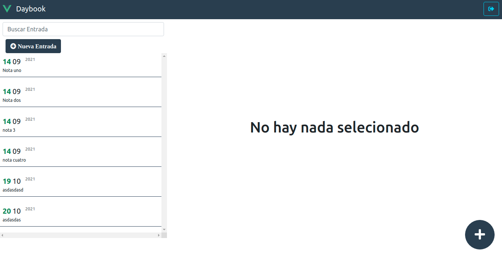
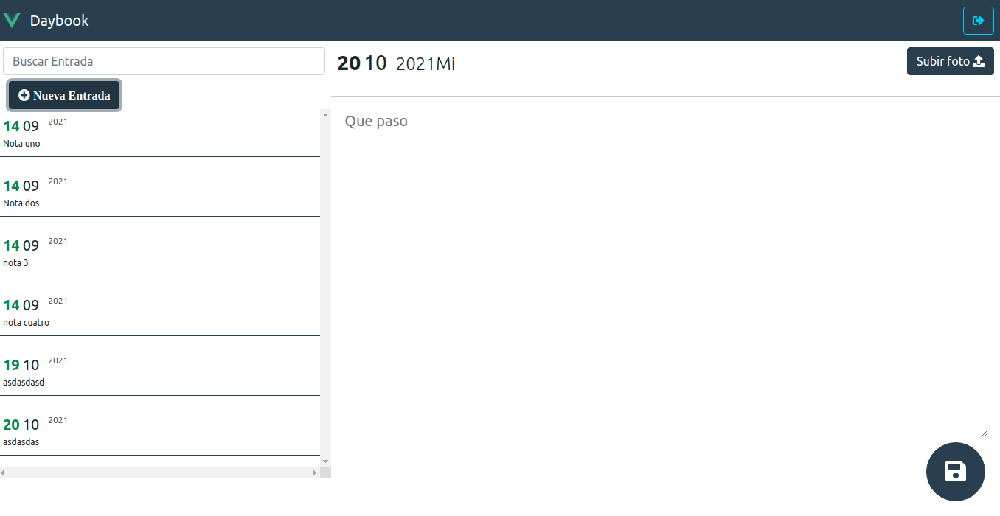
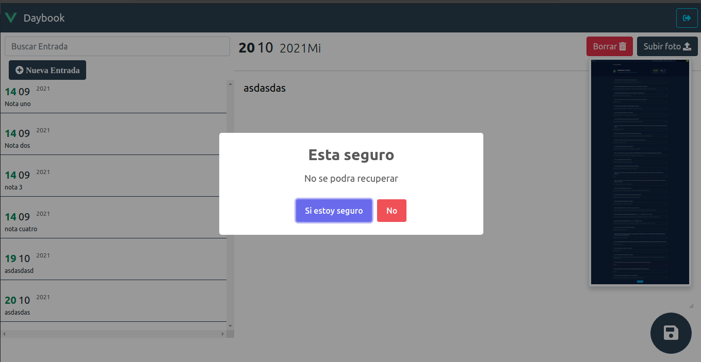

# journal-app-vuex


Este proyecto hacer parte del curso Vue.js: De cero a experto `https://www.udemy.com/course/vuejs-fh/` 

Para posteriomente desplegarlo en Netlify


## Project setup
```
yarn install
```

### Compiles and hot-reloads for development
```
yarn serve
```

### Compiles and minifies for production
```
yarn build
```

### Lints and fixes files
```
yarn lint
```

### Visualizacion
Visualizacion de la aplicacion





### URL 

> https://journal-app-vuex-favillon.netlify.app/#/daybook